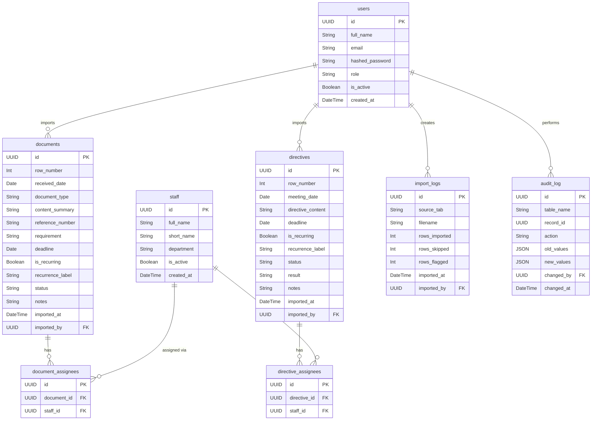

# Entity Relationship Diagram (ERD)

Database schema for the deadline management app. 8 tables across 3 logical groups.

---

## Table groups

### Group 1 — Auth
| Table | Purpose |
|-------|---------|
| `users` | Admin accounts who log into the app. Role is `super_admin` or `admin` |

### Group 2 — Core data (imported from Excel)
| Table | Purpose |
|-------|---------|
| `staff` | People assigned to tasks. Auto-extracted from Excel on import |
| `documents` | Rows from Tab 1 — Theo dõi CV Tháng 4 |
| `directives` | Rows from Tab 2 — Chỉ đạo LĐP giao ban |
| `document_assignees` | Junction table — many-to-many between documents and staff |
| `directive_assignees` | Junction table — many-to-many between directives and staff |

### Group 3 — System records
| Table | Purpose |
|-------|---------|
| `import_logs` | One record per Excel upload. Tracks filename, row counts, timestamp |
| `audit_log` | Every create/update/delete on any table. Stores old and new values as JSON |

---

## Relationship notation

| Symbol | Meaning |
|--------|---------|
| `\|\|` | Exactly one |
| `o{` | Zero or many |
| `\|\|--o{` | One to many |

---

## Key design decisions

**`users` vs `staff` are separate tables** — `users` are people who log into the app (admins). `staff` are the people being tracked and assigned to tasks. Right now only one admin exists, but the schema supports multiple admins in the future without any changes.

**Junction tables for assignees** — a document can be assigned to multiple staff members (e.g. `"KS. Tiến\nKS. Bảo"` in the Excel). A simple `assigned_to` text column would lose this structure. The junction tables `document_assignees` and `directive_assignees` handle many-to-many cleanly and allow filtering by staff.

**`is_recurring` + `recurrence_label`** — some tasks in Tab 2 have `THỜI HẠN = "Mỗi ngày"` (every day) instead of a date. These need a boolean flag so the scheduler never marks them overdue, and a label to display in the UI.

**`status` as a string enum** — values are `pending`, `in_progress`, `overdue`, `done`, `cancelled`. See `state_diagram.md` for full transition rules.

**`audit_log.old_values` and `new_values` as JSON** — storing changes as JSON means any table can be audited without changing the audit_log schema. One table handles all history for all records.

**`import_logs.rows_flagged`** — rows where no deadline could be extracted from free text are flagged rather than rejected. Admin sees the count and can fix them manually after import.