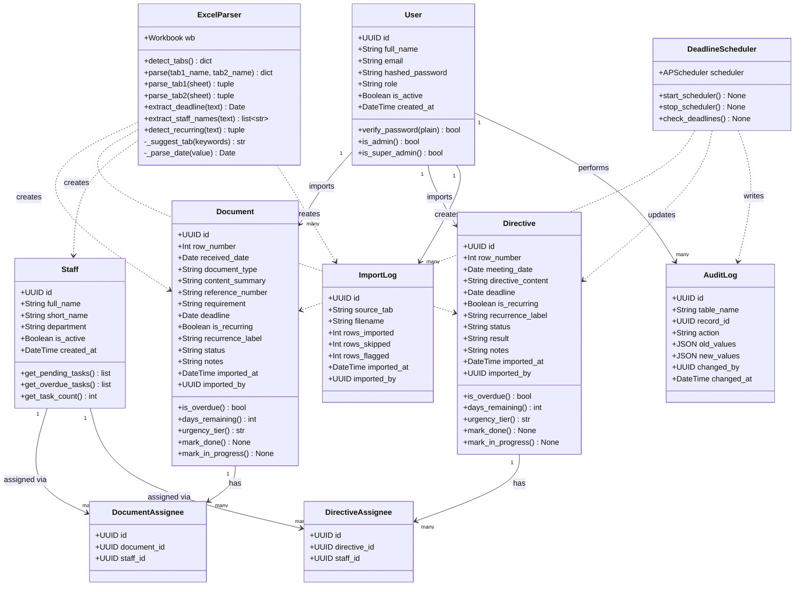

# Class diagram

Python SQLAlchemy models and service classes for the deadline management backend.

---

## Notes

**Solid arrows (`-->`)** — persistent database relationships (foreign keys in the ERD).

**Dashed arrows (`..>`)** — service dependencies. `ExcelParser` and `DeadlineScheduler` are not database models — they are Python service classes that create or update the model instances.

**`Document` and `Directive` share the same methods** (`is_overdue`, `days_remaining`, `urgency_tier`, `mark_done`, `mark_in_progress`) — currently stubbed as `...` on each model; urgency computation lives in the dashboard router.

**`ExcelParser`** is the most critical service class. Its `extract_deadline()` method uses Python regex + `dateutil` to parse Vietnamese date strings embedded in free text (e.g. `"KS. Phú hoàn thành trước 15/5/2026"`).

**`DeadlineScheduler`** wraps APScheduler and runs `check_deadlines()` every hour independently of any user request.