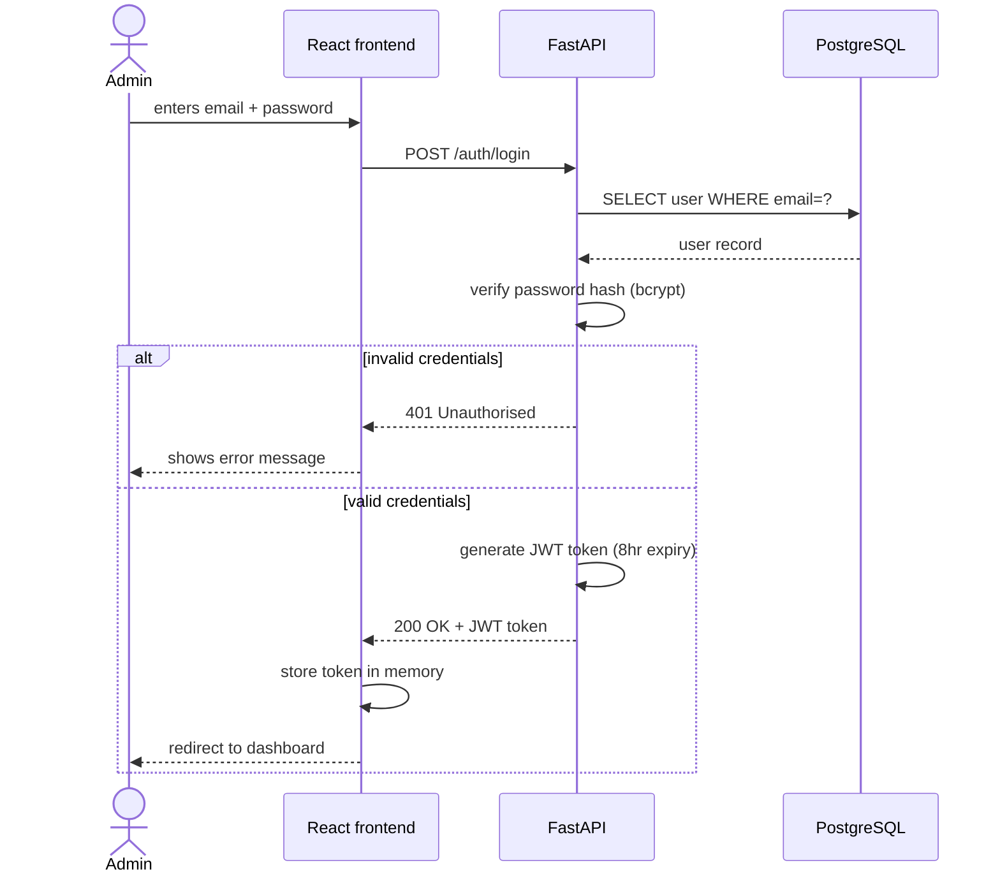
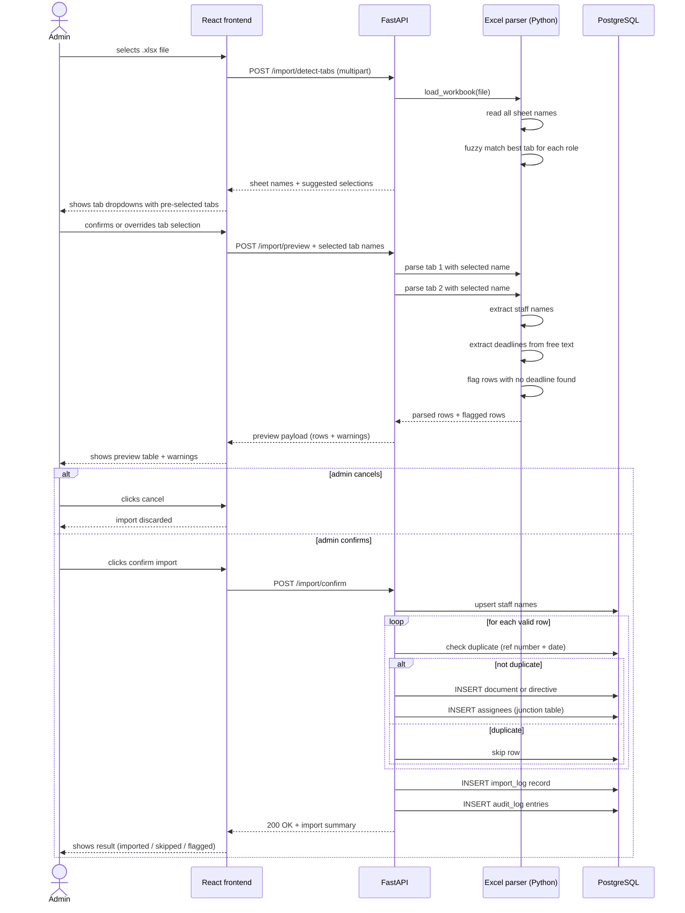
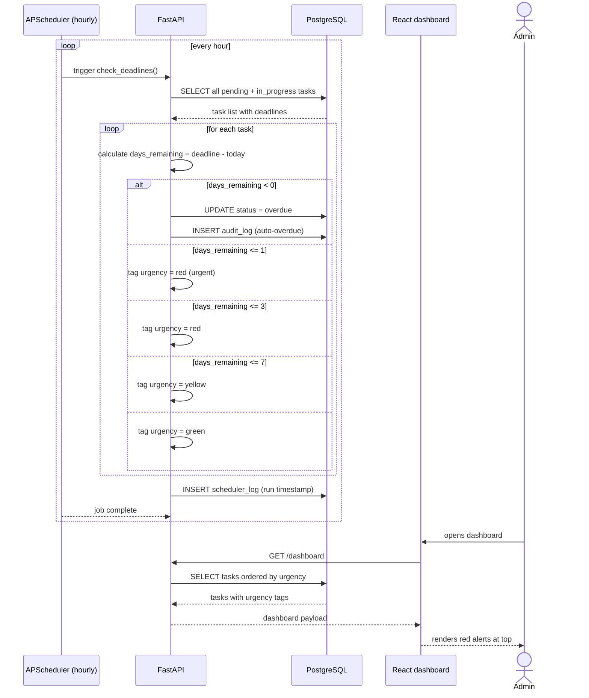

# Sequence diagrams
 
Three core flows that define how the system behaves.
 
---
 
## Flow 1 — Admin login
 

 
**Key decisions:**
- Password hashed with bcrypt — never stored in plain text
- JWT stored in memory (not localStorage) — safer against XSS attacks
- Token expires after 8 hours — admin must re-login each working day
---
 
## Flow 2 — Excel import
 

 
**Key decisions:**
- Two-step flow (preview → confirm) prevents accidental data overwrites
- Duplicate detection uses reference number + date as a composite key
- Flagged rows (no deadline found) are still shown — admin fixes manually
- Both tabs are parsed in a single upload request
- Every import is recorded in `import_log` and `audit_log`
---
 
## Flow 3 — Automated deadline notification
 

 
**Key decisions:**
- Scheduler runs independently every hour — no user action required
- Urgency tiers: red urgent (≤1 day), red (≤3 days), yellow (≤7 days), green (>7 days)
- Overdue status is set automatically and logged in audit_log
- Dashboard fetches pre-computed urgency — fast load, no recalculation on request
- Recurring tasks (`is_recurring = true`) are excluded from overdue logic