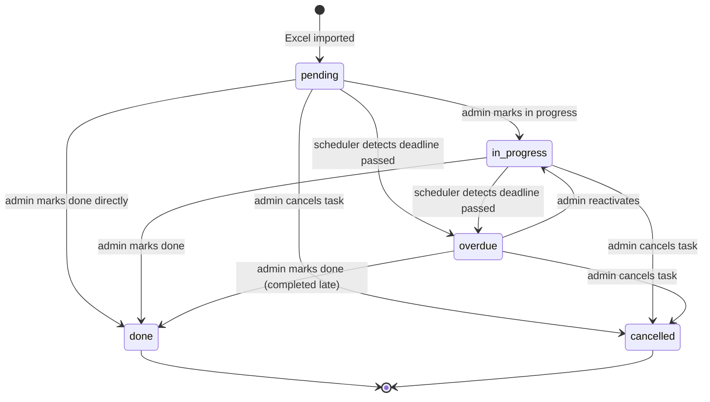

# State diagram

Task status lifecycle for both `documents` and `directives` tables.



---

## States explained

| State | Who sets it | Dashboard colour | Description |
|-------|-------------|-----------------|-------------|
| `pending` | System (on import) | green / yellow / red | Task imported, not started yet. Colour depends on days remaining |
| `in_progress` | Admin manually | green / yellow / red | Admin has started work. Still shows urgency colours |
| `overdue` | APScheduler (automatic) | red + OVERDUE badge | Deadline has passed and task is not done |
| `done` | Admin manually | hidden by default | Task completed. Timestamp recorded |
| `cancelled` | Admin manually | hidden | Task no longer relevant. Kept for audit history |

---

## Key rules

**`pending` is the entry point** — every row imported from Excel starts here regardless of deadline proximity. The dashboard colour is computed dynamically from `days_remaining()`, not stored as a separate field.

**`overdue` is set by the scheduler, not the admin** — APScheduler runs every hour and transitions any `pending` or `in_progress` task whose deadline has passed to `overdue`. The admin never sets this manually.

**`done` can be reached from any active state** — admin can mark a task done whether it is `pending`, `in_progress`, or `overdue`. If done from `overdue`, it means completed late — the completion timestamp records this.

**`cancelled` is a soft delete** — the row stays in the database for audit purposes. It just disappears from the active dashboard. This is intentional — you never want to lose the history of a task.

**Recurring tasks never reach `overdue`** — tasks with `is_recurring = true` are excluded from the scheduler's overdue check entirely. They stay `pending` indefinitely until manually marked done.

---

## How this maps to Python code

Status values are plain strings stored directly in the `documents.status` and `directives.status` columns, enforced by a PostgreSQL CHECK constraint:

```sql
status VARCHAR CHECK (status IN ('pending', 'in_progress', 'overdue', 'done', 'cancelled'))
```

The scheduler sets `overdue` automatically. Manual status transitions (`mark_done`, `mark_in_progress`) are stubbed on the model classes — transition enforcement is planned for the API layer.